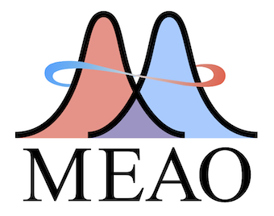

# Maximally Entangled Atomic Orbitals (MEAO) for Bonding Analysis


This is a package for covalent bonding analysis using maximally entangled atomic orbitals (MEAO), and orbital entanglement. We included two example molecules for both two-center bonding and multi-center bonding analysis.

# Dependency
```Python
numpy
scipy
pyscf
block2
```

# Reference
L. Ding, E. Matito, C. Schilling, arXiv preprint, arXiv:2501.15699, 2025
